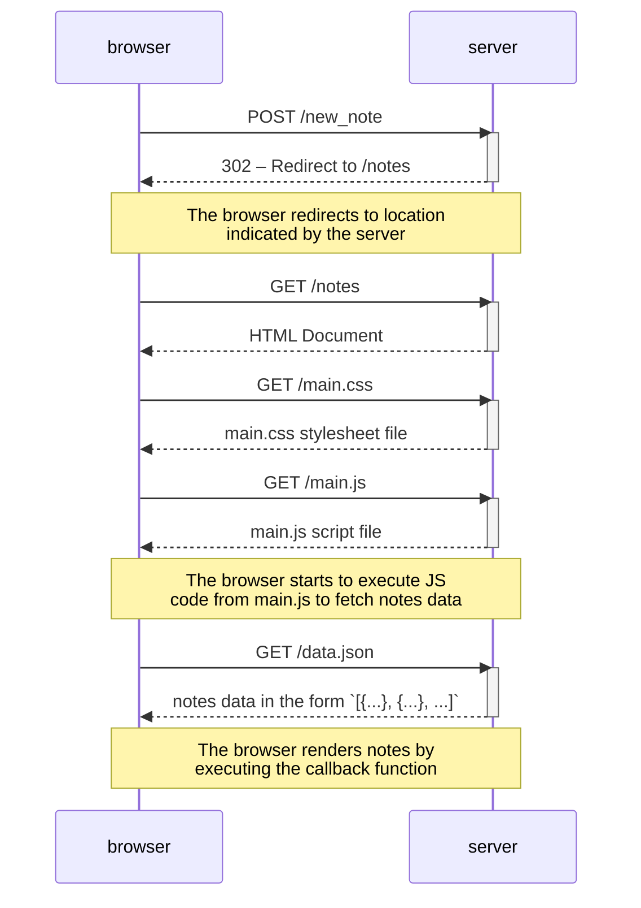

```mermaid
sequenceDiagram
  participant browser
  participant server

  browser ->> server: POST /new_note
  activate server
  server -->> browser: 302 – Redirect to /notes
  deactivate server
  Note over browser,server: The browser redirects to location <br/> indicated by the server

  browser ->> server: GET /notes
  activate server
  server -->> browser: HTML Document
  deactivate server

  browser ->> server: GET /main.css
  activate server
  server -->> browser: main.css stylesheet file
  deactivate server

  browser ->> server: GET /main.js
  activate server
  server -->> browser: main.js script file
  deactivate server
  Note over browser,server: The browser starts to execute JS <br/> code from main.js to fetch notes data

  browser ->> server: GET /data.json
  activate server
  server -->> browser: notes data in the form `[{...}, {...}, ...]`
  deactivate server
  Note over browser,server: The browser renders notes by <br/> executing the callback function
```
