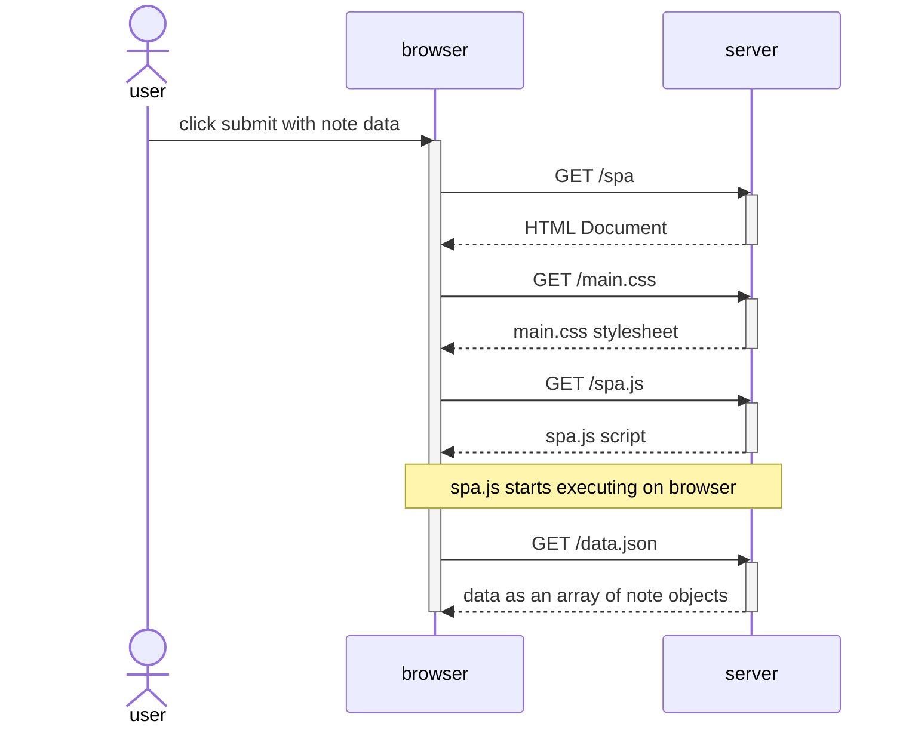

```mermaid
sequenceDiagram
  actor U as user
  participant B as browser
  participant S as server

  U ->> B: click submit with note data

  activate B

  B ->> S: GET /spa
  activate S
  S -->> B: HTML Document
  deactivate S

  B ->> S: GET /main.css
  activate S
  S -->> B: main.css stylesheet
  deactivate S

  B ->> S: GET /spa.js
  activate S
  S -->> B: spa.js script
  deactivate S

  Note over B,S: spa.js starts executing on browser

  B ->> S: GET /data.json
  activate S
  S -->> B: data as an array of note objects
  deactivate S

  deactivate B
```
